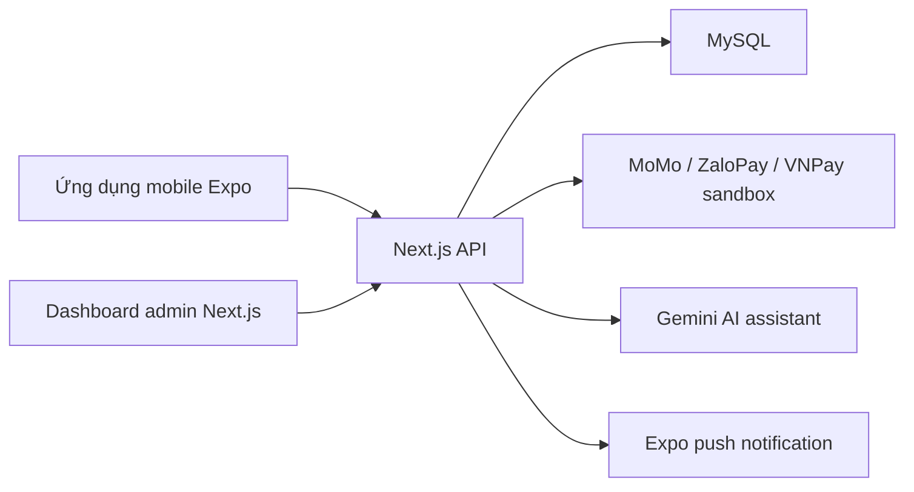
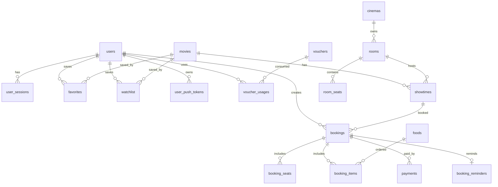
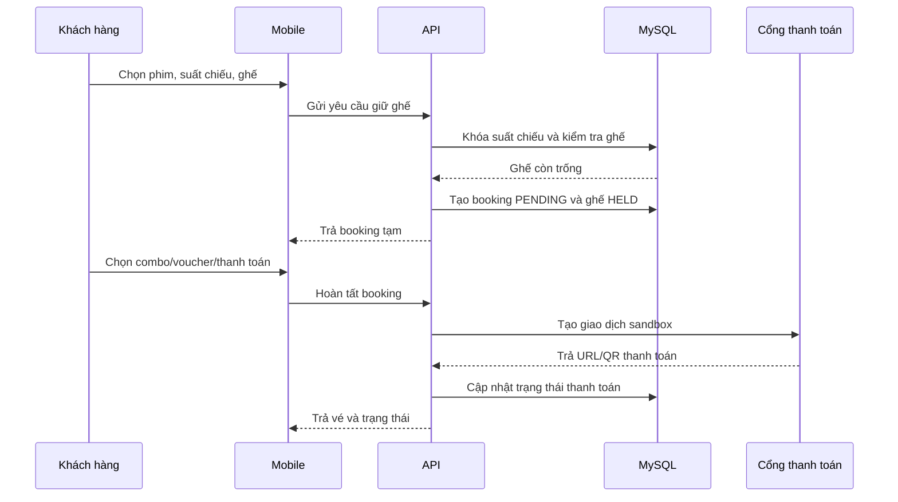

# Báo cáo kỹ thuật dự án DatVe

## 1. Tổng quan

DatVe là hệ thống đặt vé xem phim gồm ba phần chính: ứng dụng mobile cho khách hàng, dashboard quản trị cho nhân sự rạp và backend API xử lý dữ liệu, giữ ghế, thanh toán, voucher, vé, thông báo và gợi ý bằng AI.

Mục tiêu hiện tại phù hợp để báo cáo tốt nghiệp ở mức sản phẩm hoàn chỉnh có thể demo: có đăng nhập, danh mục phim, chọn suất chiếu, chọn ghế, combo, voucher, thanh toán sandbox, quản lý vé, yêu thích, xem sau, admin CRUD và thống kê cơ bản.

## 2. Kiến trúc



## 3. Chức năng chính

- Khách hàng: đăng ký, đăng nhập, xem phim, lọc phim, xem chi tiết, chọn suất chiếu, chọn ghế, mua combo, dùng voucher, thanh toán sandbox, xem vé, lưu yêu thích và xem sau.
- Admin: dashboard, quản lý phim, banner, rạp, phòng, ghế, suất chiếu, người dùng, combo, voucher, booking và check-in.
- Backend: xác thực token, seat map, giữ ghế tạm thời, tránh đặt trùng, hoàn tất booking, ghi nhận thanh toán, voucher một lần, thông báo lịch chiếu và AI assistant gợi ý phim.

## 4. ERD rút gọn



## 5. Luồng đặt vé



## 6. Kiểm thử và xác minh

Đã bổ sung test tự động cho:

- Tính giá ghế thường, VIP, ghế đôi và khu hot.
- Tính voucher phần trăm, voucher cố định, đơn tối thiểu, voucher hết hạn/tắt.
- Kiểm tra luồng giữ ghế có khóa giao dịch `FOR UPDATE` và chặn chọn trùng ghế.

Lệnh xác minh:

```powershell
npm run verify
```

Build Android release local cần cài JDK và cấu hình `JAVA_HOME`:

```powershell
npm run android:release --workspace mobile
```

## 7. Đánh giá mức độ sẵn sàng báo cáo tốt nghiệp

Dự án đã đủ nền tảng để báo cáo tốt nghiệp vì có đủ ba vai trò: khách hàng, quản trị và backend nghiệp vụ. Điểm mạnh là luồng đặt vé khá đầy đủ, có xử lý giữ ghế, thanh toán sandbox, voucher, vé, admin dashboard, dữ liệu mẫu và tài liệu chạy dự án.

Những phần cần trình bày là giới hạn kỹ thuật:

- Thanh toán đang ở sandbox, chưa đấu production thật.
- Upload media backend còn lưu local, khi deploy serverless cần chuyển sang cloud storage.
- Rate limit hiện phù hợp demo/đồ án, nếu tải lớn nên dùng Redis hoặc dịch vụ cache tập trung.
- `npm audit` còn cảnh báo moderate từ cây phụ thuộc Next.js/PostCSS; chưa ép nâng phá vỡ app.

## 8. Hướng cải tiến tiếp theo

- Chuyển danh sách dài trên mobile sang `FlatList`/`FlashList` khi dữ liệu phim và vé lớn.
- Thêm test tích hợp API với MySQL test container hoặc database riêng.
- Thêm pipeline CI chạy `npm run verify` trước khi merge/deploy.
- Bổ sung cloud storage cho poster/banner và giới hạn kích thước file upload.
- Thêm Redis cho rate limit, giữ ghế và cache danh mục phim khi có nhiều người dùng đồng thời.
- Bổ sung báo cáo doanh thu theo ngày/tháng/rạp/phim và xuất Excel/PDF cho admin.
- Chuẩn hóa payment callback production, log đối soát giao dịch và retry webhook.
